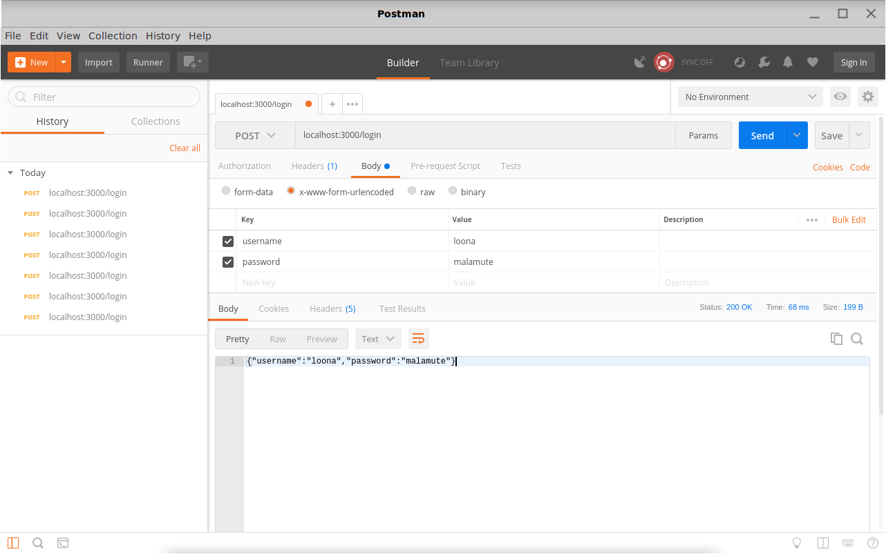

# Post Requests

source: [Sending and Receiving Form Data by Mozilla Contirbutors](https://developer.mozilla.org/en-US/docs/Learn/HTML/Forms/Sending_and_retrieving_form_data)

## Lesson

The [HTTP protocol](/en-US/docs/HTTP "/en-US/docs/HTTP") provides several ways to perform a request. The most common of these are the `GET` method and the `POST` method.

To understand the difference between those two methods, let's step back and examine how HTTP works. Each time you want to reach a resource on the Web, the browser sends an HTTP request to some server. An HTTP request consists of two parts: a header that contains a the url and information about the browser, and a body that can contain additional information.

### The GET method

The `GET` method is used by the browser to ask the server to send back a specific resource: "Hey server, I want to get this resource." In this case, the browser sends an empty body. When a form is sent using this method, the form data sent to the server is appended to the URL.

Consider the following form:

```html
<form action="http://foo.com" method="get">
  <div>
    <label for="say">What greeting do you want to say?</label>
    <input name="say" id="say" value="Hi">
  </div>
  <div>
    <label for="to">Who do you want to say it to?</label>
    <input name="to" value="Mom">
  </div>
  <div>
    <button>Send my greetings</button>
  </div>
</form>
```

Since the `GET` method has been used, the URL will be `www.foo.com/?say=Hi&to=Mom` when you submit the form.

The HTTP request looks like this:

<pre>
GET /?say=Hi&to=Mom HTTP/1.1
Host: foo.com
</pre>

### The POST method

The `POST` method is used to when theres is data provided in the body of the HTTP request:

*"Hey server, take a look at this data and send me back an appropriate result."*

If a form is sent using this method, the data is appended to the body of the HTTP request.

Let's look at an example — this is the same form we looked at in the `GET` section above, but this time with the `POST` method.

```html
<form action="http://foo.com" method="post">
  <div>
    <label for="say">What greeting do you want to say?</label>
    <input name="say" id="say" value="Hi">
  </div>
  <div>
    <label for="to">Who do you want to say it to?</label>
    <input name="to" value="Mom">
  </div>
  <div>
    <button>Send my greetings</button>
  </div>
</form>
```

When the form is submitted using the `POST` method, you get no data appended to the URL, and the HTTP request looks like so, with the data included in the request body instead:

<pre>POST / HTTP/1.1
Host: foo.com
Content-Type: application/x-www-form-urlencoded
Content-Length: 13

say=Hi&to=Mom</pre>

The `Content-Length` header indicates the size of the body, and the `Content-Type` header indicates the type of resource sent to the server.

### Which one to use

1. If you need to get publicly available information, use the `GET` method.
2. If you need to send a password (or any other sensitive data), never use the `GET` method or you risk displaying it in the URL bar, which would be very insecure.
3. If you want to change the value of data stored on the server (based on input from the request) use the `POST` method.

### Handling Post Requests in Express

In order to handle `post` requests in express, you will need to install the [body-parser module](https://github.com/expressjs/body-parser). The body parser provides an easy way for getting the contents of a request's body.

First, install it with npm:

```bash
npm install --save body-parser
```

Then we will `require` it in our javascript server file, and tell express to `use` the body parser:

```js
var express = require('express')
var bodyParser = require('body-parser')

var app = express()

// parse application/x-www-form-urlencoded
app.use(bodyParser.urlencoded({ extended: false }))

// parse application/json
app.use(bodyParser.json())
```

Above, `app.use` is called twice because there are two ways to encode the body of a `post` request. Don't worry about this detail for now.

After express had been instructed to use the body parser, the body of every request will be available in the request `body` property.

Below is a simple example where the request's body is simply sent back to the client. We use the `app.post` method to exclusively handle _post_ requests. We use the `res.json` method to convert the body object to a json string and send it as a response.

```js
var express = require('express')
var bodyParser = require('body-parser')
const port = 3000;

var app = express()

// parse application/x-www-form-urlencoded
app.use(bodyParser.urlencoded({ extended: false }))

// parse application/json
app.use(bodyParser.json())

app.post('/moods', (req, res) => {
  console.log(req.body)
  res.json(req.body)
})

app.listen(port, () => {
  console.log(`Listening on port ${port}!`)
})
```

Once we've the express server, we can send a `post` request using postman.



* Make sure to choose `POST` in the request type dropdown.
* Insert `localhost:3000/moods` as the request url.
* Switch to the `Body` tab, and choose `x-www-form-urlencoded` in the radio buttons.
* Now you can begin insert key-value pairs that the request body will consist of.
  * key: `name`, value: `Loona`
  * key: `mood`, value:
  `sleepy`
* Click on the `send` button. You should see the response in the text area:

```text
{"name":"loona","mood":"sleepy"}
```

### Persisting Data

Let's try and the request body on the server. Whenever our server gets a `post` request, it will append the name and mood to a text file.

```js
const fs = require('fs')

app.post('/moods', function (req, res) {
  console.log(req.body)
  const nameAndMood = req.body.name + ' ' + req.body.mood;
  fs.appendFile('moods.txt', nameAndMood + '\n', (err) => {
    if (err) throw err;
    console.log('appended to file');
    res.send('success')
  });
})
```

Note that if the request body doesn't have a `name` or `mood`, the word `undefined` will be appended to the file. We can fix that, and send an appropriate resonse if there is no name or mood:

```js
app.post('/moods', (req, res) => {
  if (!req.body.name || !req.body.mood) {
    return res.send('please specify a name and mood')
  }

  const nameAndMood = req.body.name + ' ' + req.body.mood;
  fs.appendFile('moods.txt', nameAndMood + '\n', (err) => {
    if (err) { throw err };
    console.log('appended to file');
    res.json(req.body)
  });
})
```

### Storing data as JSON

We can store complex data in the JSON format. We first call the `JSON.stringify` method on the variable we want to save, and append the resulting string to a file. Note that the code below will not work as expected - we will discuss the problem below.

```js
app.post('/moods', (req, res) => {
  if (!req.body.name || !req.body.mood) {
    return res.send('please specify a name and a mood')
  }

  fs.appendFile('moods.json', JSON.stringify(req.body), (err) => {
    if (err) { throw err };
    console.log('Appended to the file!');
    res.send('success')
  });
})
```

After we have saved two or more name-mood objects, our json file will look like this:

```json
{"name":"Loona","mood":"sleepy"}{"name":"Whiskers","mood":"hungry"}
```

Note that this is not valid json (and not valid javascript either). and attempting to `JSON.parse` it will result in an error. Valid json will look like a javascript array of objects. In order to achieve that, we will need to perform some steps on every `post` request:

* If a `moods.json` file does not exists, create a new array with the `req.body` as its only element. `JSON.stringify` the array and save it to `moods.json`
* If a `moods.json` file already exists:
  1. parse the file into a javascript array.
  2. Add the new name-mood object from `req.body` into the array.
  3. Save the array into the `moods.json` file, overwriting the existing content.

Note that we will to save the data successfully as json, we will need to read the content into memory, add the new name-mood object, and overwrite the existing file - *every time*. As long as our json file is small this will be fine performance-wise.

To avoid repetetive code, we will create a function called `writeFile`, that takes as arguments a filename, the data to write, and the response object. The function writes the data to the file (overwriting any existing data), and sends an appropriate response. We use the `return` statement to finish the function execution early. The returned value will not be used anywhere.

```js
const writeFile = (filename, data, res) => {
  fs.writeFile(filename, data, (err) => {
    if (err) {
      return res.send(err)
    }
    res.send('success')
  })
}
```

Now let's write the rest of the code:

```js
const moodsFile = 'moods.json';

app.post('/moods', function (req, res) {
  if (!req.body.name || !req.body.mood) {
    return res.send('please specify a name and a mood')
  }

  fs.readFile(moodsFile, 'utf8', (err, data) => {
    if (err) {
      // Check if the file does not exist
      if (err.code === 'ENOENT') {
        const jsonArr = JSON.stringify([req.body])
        return writeFile(moodsFile, jsonArr, res)
      }
      return res.send(err)
    }
    // Parsing the file into an array
    const moodsArr = JSON.parse(data);
    // using the ES6 spread operator to take all elements from the array
    const jsonArr = JSON.stringify([...moodsArr, req.body])
    writeFile(moodsFile, jsonArr, res)
  })
})
```

Finally, let's send the log of names and moods to the client on a `get` request to _moods_:

```js
app.get('/moods', (req, res) => {
  fs.readFile(moodsFile, 'utf8', (err, data) => {
    if (err) {
      return res.send(err)
    };
    res.send(data)
  })
})
```
