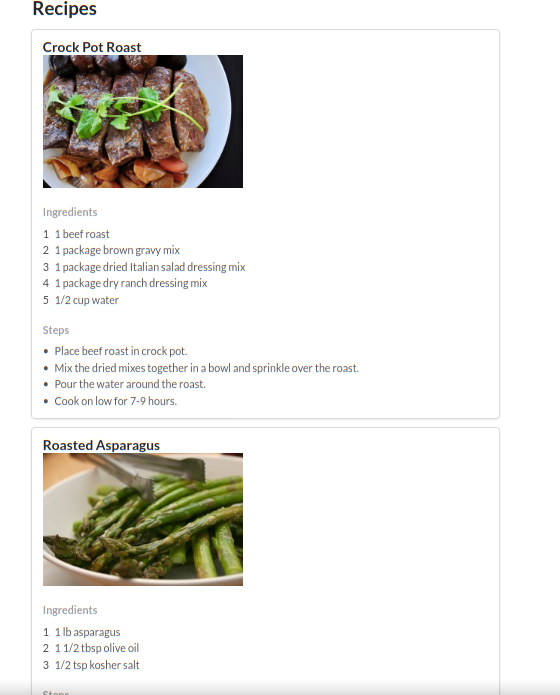
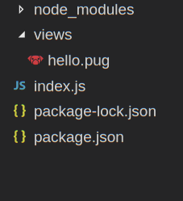

# The Pug Template Engine - Part 1

## Resources

* [Express Tutorial Part 5, by Mozilla Contributors](https://developer.mozilla.org/en-US/docs/Learn/Server-side/Express_Nodejs/Displaying_data)
* [Using Template Engines With Express](https://expressjs.com/en/guide/using-template-engines.html)
* [A Jade Tutorial For Beginners](https://www.sitepoint.com/jade-tutorial-for-beginners/)
* [Pug - Getting Started](https://pugjs.org/api/getting-started.html)

## Lesson

## Introduction to Web Template Engines

One problem with writing html for web content is that we have to hardcode information. Take for example a website that displays a list of recipes, where each recipe consists of a header, an image, a list of ingerdients and a list of steps.



Below is the HTML for a single recipe:

```html
<div class="ui fluid card">
  <div class="content">
    <a class="header" href="recipes/id/1">Crock Pot Roast</a>
    
    <h3 class="meta">Ingredients</h3>
    <div class="description">
        <ol class="ui ordered list">
            <li class="item">1 beef roast</li>
            <li class="item">1 package brown gravy mix</li>
            <li class="item">1 package dried Italian salad dressing mix</li>
            <li class="item">1 package dry ranch dressing mix</li>
            <li class="item">1/2 cup water</li>
        </ol>
    </div>
    <h3 class="meta">Steps</h3>
    <div class="description">
        <ul class="ui bulleted list">
            <li class="item">Place beef roast in crock pot.</li>
            <li class="item">Mix the dried mixes together in a bowl and sprinkle over the roast.</li>
            <li class="item">Pour the water around the roast.</li>
            <li class="item">Cook on low for 7-9 hours.</li>
        </ul>
    </div>
  </div>
</div>
```

What we want, instead of writing the html by hand, is a way to generate it. We want to be able to get the recipe data from a database or `JSON` file, and use that data to generate our html.

It is possible to do the above in pure javasascript. Once we have the recipe data as an array of objects:

```js
[
  {
    id: 1,
    name: "Crock Pot Roast",
    ingredients: [
      "1 beef roast",
      "1 package brown gravy mix",
      "1 package dried Italian salad dressing mix",
      "1 package dry ranch dressing mix",
      "1/2 cup water"
    ],
    steps: [
      "Place beef roast in crock pot.",
      "Mix the dried mixes together in a bowl and sprinkle over the roast.",
      "Pour the water around the roast.",
      "Cook on low for 7-9 hours."
    ],
    imageURL: "http://img.sndimg.com/food/image/upload/w_266/v1/img/recipes/27/20/8/picVfzLZo.jpg"
  },
  {
    id: 2,
    name: "Roasted Asparagus",
    ingredients: [
      "1 lb  asparagus",
      "1 1/2 tbsp olive oil",
      "1/2 tsp kosher salt"
    ],
    ...
```

We can loop over it and use _DOM_ methods such as `createElement` and `appendChild` to create the corresponding html.

We can also create html by using template literals. We have discussed this for simple cases, such as:

```js
const createHTML = (name) => `
<html>
  <head>
  </head>
  <body>
    <p> hello ${name}!</p>
  </body>
</html>
`
```

Web templates are more like the latter approach, but provide additional benefits over template literals.

A template engine is similar to a programming lanuage - each engine has its own syntax
Template engines generates html from _template_ files.  Templates file define the layout of an HTML document, with variables  where data to be inserted at a later point. (when the template is _rendered_).

We will be using [Pug](https://pugjs.org/api/getting-started.html) (formerly known as _Jade_) for our templates.

Different template languages use different approaches for defining the layout and marking variables — some use HTML to define the layout while, others use different markup formats that can be compiled to HTML. Pug is of the second type; it uses a _representation_ of HTML where the first word in a line usually represents an HTML element, and indentation on subsequent lines is used to represent any content nested within those elements.

Here is an example of a simple pug template:

```pug
doctype html
html(lang="en")
  head
    title Best Page Evrrr
  body
    h1 Pug - node template engine
    div(class="container")
      h2 Hello #{name}
```

### Template syntax

The first thing to notice is that the file maps the structure of a typical HTML file, with the first word in (almost) every line being an HTML element, and indentation being used to indicate nested elements. So for example, the `body` element is inside an `html` element, and paragraph elements (`p`) are within the `body` element, etc. Non-nested elements (e.g. individual paragraphs) are on separate lines.

Above you can see some features of pug:

* no opening/closing tags. The indentation dictates where tags will open and close.
* Parentheses for attributes.
* Interpolation: this is similar to the JS template literal syntax `${...}`. Pug will expect a variable `name` and will inject the value in place of `#{name}`.

Let's say the above template is in a file named `hello.pug`. We can then use it in our _express_ server to generate an HTML document and send it to the client:

```js
res.render('hello', {name: 'Mike'})
```

Which will lead the client to receive the following HTML:

```html
<!DOCTYPE html>
<html lang="en">

<head>
  <title>Best Page Evrrr</title>
</head>

<body>
  <h1>Pug - node template engine</h1>
  <div class="container">
    <h2>Hello Mike</h2>
  </div>
</body>

</html>
```

### Setting Up Pug with Express

To use pug, we will first set up an express server:

1. `npm init`
2. `npm install --save express morgan body-parser`
3. `npm install --save-dev nodemon`

Once we have the above, we will install pug: `npm install --save pug` (we could have installed it in step 2).

Your `package.json` should look similar to this:

```json
{
  "name": "..",
  "version": "1.0.0",
  "description": "",
  "main": "index.js",
  "scripts": {
    "test": "echo \"Error: no test specified\" && exit 1"
  },
  "author": "",
  "license": "ISC",
  "dependencies": {
    "body-parser": "^1.18.2",
    "express": "^4.16.2",
    "morgan": "^1.9.0",
    "pug": "^2.0.0-rc.4"
  },
  "devDependencies": {
    "nodemon": "^1.12.1"
  }
}
```

Now we will tell _express_ that we're using pug as the view (i.e. template) engine, and that it should search for templates in the **/views** subdirectory.

```js
const express = require('express');
const app = express();
const path = require('path')

// Set express to use pug as the view engine
app.set('views', path.join(__dirname, 'views'));
app.set('view engine', 'pug');
```

Now we can create a `views/` folder and inside it the mentioned above `hello.pug` file. Your code should be syntax-highlighted. You can also install extensions such as _Pug / Jade Snippets_ (available for [vscode](https://marketplace.visualstudio.com/items?itemName=mrmlnc.vscode-jade-snippets), [atom](https://atom.io/packages/jade), etc.)

Your folder structure should look like this:



Now we can add the code in `index.js` for express to start a server and render the template.

```js
...

const port = 3000;

app.get('/', (req, res) => {
  res.render('hello', { name: 'Nick' })
})

app.listen(port, () => {
  console.log(`listening to port ${port}`)
})
```

> Ex. Create an express server that will listen to the route `/:name` and generate a pug template with a greeting for the given name.

### Iteration in Pug

Pug has it'w  


