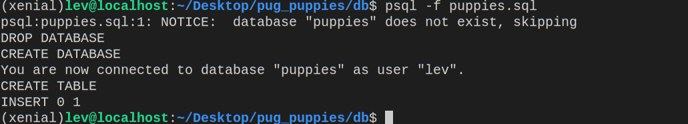

# pg-promise and Express

Download all files in this directory and put them in a folder called `puppies`.


## Linux (Chromebook) Users

To allow the server to connect to your database, you will need to modify the following file:

`/etc/postgresql/9.5/main/pg_hba.conf`


The number - **`9.5`** is the Postgres version and may vary. Consult your instructor for help. If you do not make this change, the server will **not** be able to connect to your Postgres database.

## Instructions

1. Navigate to the **`/db`** folder and look at the `puppies.sql` file. This provides us with a basic database schema and one seed puppy. Add at least 10 more puppies using `INSERT INTO`. 

2. To create (seed) the database run the following command from the same folder:

```bash
psql -f puppies.sql
```

After pressing `<enter>` you should see something similar to the following in your command line:



3. Navigate to the root folder of the project and run `npm install` (note that I don't have a `node_modules` file here on GitHub because `npm install` generates one for us based on our `package.json` file).

4. Start the server with `npm start`. This will start the express server with `nodemon`.

5. Navigate to `http://localhost:3000/api/puppies/` in your browser. Notice what shows up in the console as well as what you can see in the browser.

6. Take a look at `/db/queries.js` in the text editor of your choice. Notice the function `getAllPuppies`. Now, look at `routes/index.js`. Notice how these two files worked together to a) query your database using the pg-promise function `any` and the proper SQL query and b) route the result to the proper URL.

7. Create and configure the following queries and corresponding routes:
  * `get`, `/api/puppies/:id`, `getSinglePuppy`
  * `post`, `/api/puppies`, `createPuppy`
    - Test this in the terminal using:
    
      ```bash
      
      curl --data "name=Whisky&breed=annoying&age=3&sex=f" \ http://127.0.0.1:3000/api/puppies
      
      ```
      
    - (Feel free to use different values if you don't want to make an annoying puppy named Whisky.)
  * `put`, `/api/puppies/:id`, `updatePuppy`
    - Test this in the terminal using:
    
      ```bash
      
      curl -X PUT --data "name=Hunter&breed=annoying&age=33&sex=m" \ http://127.0.0.1:3000/api/puppies/1
      
      ```
    
  * `delete`, `/api/puppies/:id`, `removePuppy`
    - Test this in the terminal using:
    
    ```bash
    curl -X DELETE http://127.0.0.1:3000/api/puppies/1
    ```
