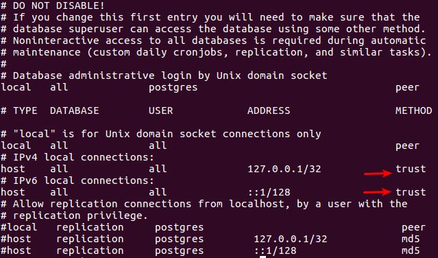

# Puppies Web App: Express - Postgres - Pug

## Linux (Chromebook) Users

To allow the server to connect to your database, you will need to modify the following file:

`/etc/postgresql/9.5/main/pg_hba.conf`

You will need to set the auth_method to `trust` (without quotes) as indicated below. This way, postgres will allow any local connection without requiring authentication.



The number - **`9.5`** is the postgress version, and may vary. Consult your instructor for help. If you do not make this change, the server will **not** be able to connect to your postgress database.

## All Users

1. To create (seed) the database, navigate to the **`/db`** folder and run the following command:

```bash
psql -f puppies.sql
```

After pressing `<enter>` you should see something similar to the following in your command line:


2. Navigate to the root folder of the project and run `npm install`.

3. Start the server with `npm start` this will start the express server with `nodemon`.