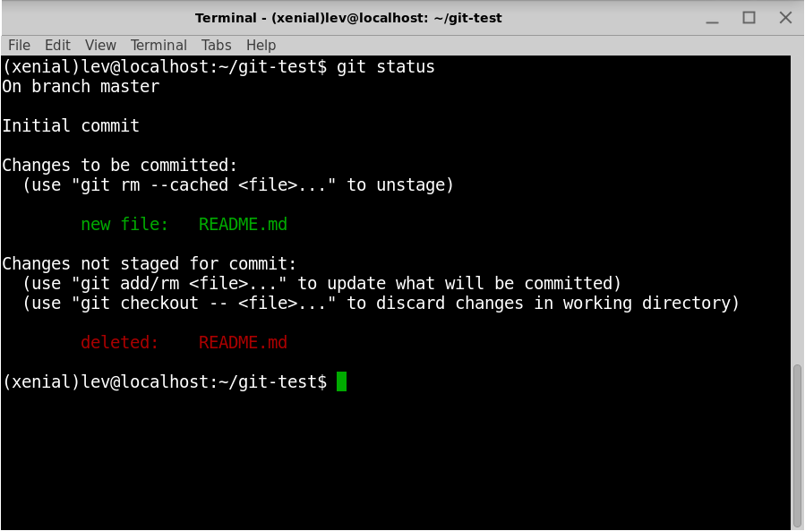

# Git and Github

## Links

* [Learn Enough Git To Be Dangerous](https://www.learnenough.com/git-tutorial)

## Lesson

A version control system (or VCS) provides an automatic way to track changes in software projects, giving creators the power to view previous versions of files and directories, develop speculative features without disrupting the main development, securely back up the project and its history, and collaborate easily and conveniently with others. In addition, using version control also makes deploying production websites and web applications much easier.

### Getting started

The most common way to use Git is via a command-line program called git, which lets us transform an ordinary folder into a repository (or repo for short) that enables us to track changes to our project.

The easiest way to check for Git is to start a terminal window and use which6 at the command line to see if the git executable is already present:

```bash
$ which git
/usr/local/bin/git
```

If the result is empty or if it says the command is not found, it means you have to install Git.

### Initializing a Repo

We’ll begin by making a directory with the name `git-test`:

```bash
$ mkdir git-test
$ cd git-test
```

The way to create a new repository with Git is with the init command (short for “initialize”), which creates a special hidden directory where Git stores the information it needs to track our project’s changes.

```bash
$ git init
Initialized empty Git repository in  /home/lev/git-test/.git/
```

### Initial Commit



We see here that the README.md file is “untracked”, which means Git doesn’t yet know about it. We can add it using the `git add` command:

```bash
$ git add .
```

Here the `.` tells Git to add all untracked files, even if in this case there’s only one.

```bash
$ git status
On branch master

Initial commit

Changes to be committed:
  (use "git rm --cached <file>..." to unstage)

        new file:   README.md

```


