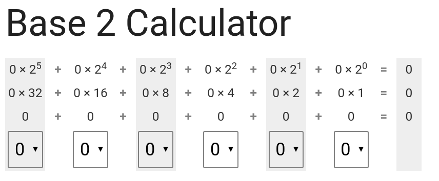
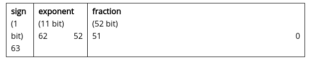

# Number Systems

## Links

* [Computer Science Field Guide - Data Representation](http://csfieldguide.org.nz/en/chapters/data-representation.html)
* [2ality - How numbers are encoded in JavaScript](http://2ality.com/2012/04/number-encoding.html)

## Vocabulary

* Base
* Decimal
* Binary
* Hexadecimal
* Bit - Binary Digit

## Lesson

### Introduction

To make computers easier to build and keep them reliable, everything is represented using just two values. You may have seen these two values represented as `0` and `1`. For example, in memory a low or high voltage is used to store each `0` or `1`.

In this lesson, we will look at how computers represent numbers. To begin with, we'll revise how the **base-10** number system that we use every day works, and then look at binary, which is **base-2**.

#### The Base 10 System

The number system that humans normally use is **base 10** - also known as **decimal**.

In decimal, the value of each digit in a number depends on its place in the number. For example, in **$123**, the **3** represents three `$1`  bills, the **2** represents two `$10` dollar bills, and the **1** represents a single `$100` dollar bill. Each place value in a number is worth 10 times more than the place value to its right, i.e. there are the “ones”, the “tens”, the “hundreds”, the “thousands” the “ten thousands”, the “hundred thousands”, the “millions”, and so on. Also, there are 10 different digits (0,1,2,3,4,5,6,7,8,9) that can be at each of those place values.

If you were only able to use one digit to represent a number, then the largest number would be 9. After that, you need a second digit, which goes to the left, giving you the next ten numbers (10, 11, 12... 19). It's because we have 10 digits that each one is worth 10 times as much as the one to its right.

Number can be expressed in “expanded form”. For example, if you want to write the number 90328 in expanded form you may write it as:

```js
90328 = 90000 + 300 + 20 + 8
```

A more sophisticated way of writing it is:

<pre>
90328 = (9 * 10000) + (0 * 1000) + (3 * 100) + (2 * 10) + (8 * 1)
</pre>

<pre>
90328 = (9 * 10<sup>4</sup>) + (0 * 10<sup>3</sup>) + (3 * 10<sup>2</sup>) + (2 * 10<sup>1</sup>) + (8 * 10<sup>0</sup>)
</pre>

Remember that any number to the power of 0 is 1. i.e. the 8 * 10<sup>0</sup> is 8, because 10<sup>0</sup> is 1.

The key ideas to notice from this are:

* Decimal has 10 digits -- 0, 1, 2, 3, 4, 5, 6, 7, 8, 9.
* A place is the place in the number that a digit is, i.e. ones, tens, hundreds, thousands, and so on. For example, in the number 90328, 3 is in the "hundreds" place, 2 is in the "tens" place, and 9 is in the "ten thousands" place.
* Numbers are made with a sequence of digits.
* The right-most digit is the one that's worth the least (in the "ones" place).
* The left-most digit is the one that's worth the most.
* Because we have 10 digits, the digit at each place is worth 10 times as much as the one immediately to the right of it.

All this probably sounds really obvious, but it is worth thinking about consciously, because binary numbers have the same properties.

### The Binary (Base 2) System

As discussed earlier, computers can only store information using bits, which only have 2 possible states. This means that they cannot represent base 10 numbers using digits `0` to `9`, the way we write down numbers in decimal. Instead, they must represent numbers using just 2 digits -- **0** and **1**.

Binary works in a very similar way to Decimal, even though it might not initially seem that way. Because there are only 2 digits, this means that each digit is 2 times the value of the one immediately to the right.



> Ex. Find the binary representations of 4, 7, 12, and 57.
> Ex. What is the largest number you can make with the above calculator? What is the smallest?

Let's try and write the binary representations for the following decimal numbers, with the provided number of digits. In some of the cases below it will not be possible.

* 101 with 7 bits
* 28 with 10 bits
* 7 with 3 bits
* 18 with 4 bits
* 28232 with 16 bits

### Puzzle: Chess Board

### What is a Byte

Groups of 8 bits are so useful that they have their own name: a byte. Computer memory and disk space are usually divided up into bytes, and bigger values are stored using more than one byte. For example, two bytes (16 bits) are enough to store numbers from 0 to 65,535. Four bytes (32 bits) can store numbers up to 4,294,967,295. You can check these numbers by working out the place values of the bits. Every bit that's added will double the range of the number.

### Numbers in Javascript

JavaScript numbers are stored in a binary format, in 64 bits. These bits are allotted as follows: The fraction occupies bits 0 to 51, the exponent occupies bits 52 to 62, the sign occupies bit 63.



The components work as follows: If the sign bit is `0`, the number is positive, otherwise negative. Roughly, the fraction contains the digits of a number, while the exponent indicates where the point is.

The largest positive integer (Whole number) we can represent with **n** (some arbitrary number) binary digits is **2<sup>n</sup> - 1**.
Consider the maximum number with `3` digits: **111<sub>2</sub>** or **7**. If we add 1 to that number we get **1000<sub>2</sub>** or  **8**. That is, the 4th binary digit is equal to the deimal number `8`, which is equal to **2<sup>3</sup>**. So, taking **2<sup>3</sup>** and substracting **1** from it gives us **7**, and that is exactly the maximum number we can represent with `3` digits. Some more examples:

* A binary number with one digit has a maximum value of **2<sup>1</sup> - 1 = 2 - 1 = 1**. That is the number **1<sub>2</sub>**
* A binary number with two digits has a maximum value of **2<sup>2</sup> - 1 = 4 - 1 = 3**. That is the number **11<sub>2</sub>**.

### The Hexadecimal (Base 16) System

Most of the time binary numbers are stored electronically, and we don't need to worry about making sense of them. But sometimes it's useful to be able to write down and share numbers, such as the colour codes specified in an HTML page.

Writing out long binary numbers is tedious --- for example, suppose you need to copy down the 16-bit number 0101001110010001. A widely used shortcut is to break the number up into 4-bit groups (in this case, 0101 0011 1001 0001), and then write down the digit that each group represents (giving 5391). There's just one small problem: each group of 4 bits can go up to 1111, which is 15, and the digits only go up to 9.

The solution is simple: we introduce symbols for the digits from 1010 (10) to 1111 (15), which are just the letters A to F. So, for example, the 16-bit binary number 1011 1000 1110 0001 can be written more concisely as B8E1. The "B" represents the binary 1011, which is the decimal number 11, and the E represents binary 1110, which is decimal 14.

Because we now have 16 digits, this representation is base 16, and known as hexadecimal (or hex for short). Converting between binary and hexadecimal is very simple, and that's why hexadecimal is a very common way of writing down large binary numbers.

> Ex. Write a full table of all the 4-bit numbers and their decimal and hexadecimal equivalent.

### How Computers Display Colors

In painting it's common to use red, yellow and blue as three "primary" colours that can be mixed to produce lots more colours. Mixing red and blue give purple, red and yellow give orange, and so on. By mixing red, yellow, and blue, you can make many new colours.

Because a colour is simply made up of amounts of the primary colours -- red, green and blue -- three numbers can be used to specify how much of each of these primary colours is needed to make the overall colour.

A commonly used scheme is to use numbers in the range 0 to 255. Those numbers tell the computer how fully to turn on each of the primary colour "lights" in an individual pixel. If red was set to 0, that means the red "light" is completely off. If the red "light" was set to 255, that would mean the "light" was fully on.

[The following interactive tool allows you to zoom in on an image to see the pixels that are used to represent it.](http://csfieldguide.org.nz/en/interactives/pixel-viewer/index.html)

### Color Codes in HTML

Colours in HTML use hexadecimal codes, two digits for each color. for example `#00FF9E`. The hash sign means that it should be interpreted as a hexadecimal representation.

This "hex triplet" format is used in HTML pages to specify colours for things like the background of the page, the text, and the colour of links.

The first 2 digits of the hexadecimal code specify the amount of red, the next 2 digits specify the amount of green, and the last 2 digits specify the amount of blue. To increase the amount of any one of these colours, you can change the appropriate hexadecimal digits.

For example, `#000000` has zero for red, green and blue, so setting a higher value to the middle two digits (such as `#004300`) will add some green to the color.

* [Click Here for a List of Named Colors Sorted by HEX Value](https://www.w3schools.com/colors/colors_hex.asp)

* [Click here for a link to an interactive color mixer](https://www.w3schools.com/colors/colors_mixer.asp)
