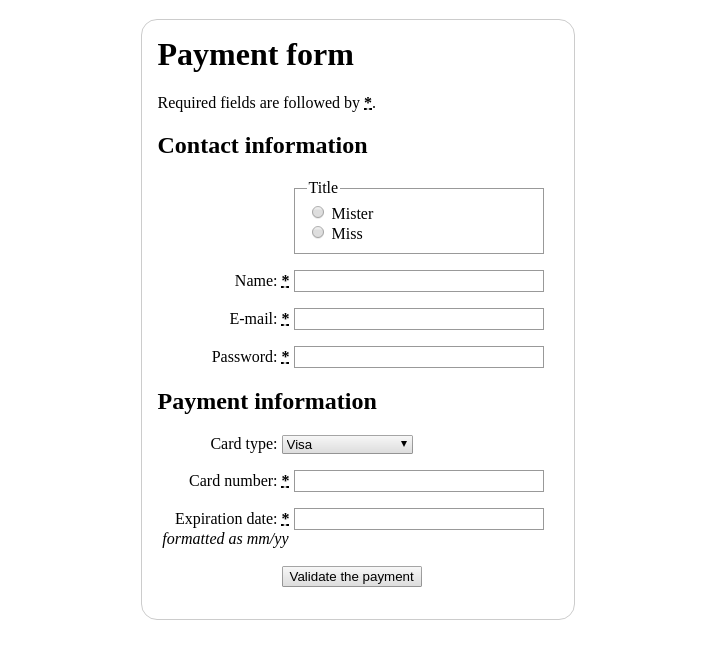

# Building a Form Structure

[Source: How to structure an HTML form, by Mozilla Contributors](https://developer.mozilla.org/en-US/docs/Learn/HTML/Forms/How_to_structure_an_HTML_form)

## Instructions

1. To start with, make a local copy of [blank template file](https://github.com/mdn/learning-area/blob/master/html/introduction-to-html/getting-started/index.html) and the [CSS for our payment form](https://github.com/mdn/learning-area/blob/master/html/forms/html-form-structure/payment-form.css) in a new directory on your computer.
2. First of all, apply the CSS to the HTML by adding the following line inside the HTML [`<head>`](/en-US/docs/Web/HTML/Element/head "The HTML <head> element provides general information (metadata) about the document, including its title and links to its scripts and style sheets."):

```html
    <link href="payment-form.css" rel="stylesheet">
```

3. Next, start your form off by adding the outer [`<form>`](/en-US/docs/Web/HTML/Element/form "The HTML <form> element represents a document section that contains interactive controls to submit information to a web server.") element:

```html
    <form>

    </form>
```

4. Inside the `<form>` tags, start by adding a heading and paragraph to inform users how required fields are marked:

```html
    <h1>Payment form</h1>
    <p>Required fields are followed by <strong><abbr title="required">*</abbr></strong>.</p>
```

5. Next we'll add a larger section of code into the form, below our previous entry. Here you'll see that we are wrapping the contact information fields inside a distinct [`<section>`](/en-US/docs/Web/HTML/Element/section "The HTML <section> element represents a standalone section of functionality contained within an HTML document, typically with a heading, which doesn't have a more specific semantic element to represent it.") element. Moreover, we have a set of two radio buttons, each of which we are putting inside its own list ([`<li>`](/en-US/docs/Web/HTML/Element/li "The HTML <li> element is used to represent an item in a list. It must be contained in a parent element: an ordered list (<ol>), an unordered list (<ul>), or a menu (<menu>). In menus and unordered lists, list items are usually displayed using bullet points. In ordered lists, they are usually displayed with an ascending counter on the left, such as a number or letter.")) element. Last, we have two standard text [`<input>`](/en-US/docs/Web/HTML/Element/input "The HTML <input> element is used to create interactive controls for web-based forms in order to accept data from the user.")s and their associated [`<label>`](/en-US/docs/Web/HTML/Element/label "The HTML <label> element represents a caption for an item in a user interface.") elements, each contained inside a [`<p>`](/en-US/docs/Web/HTML/Element/p "The HTML <p> element represents a paragraph of text."), plus a password input for entering a password. Add this code to your form now:

```html
    <section>
        <h2>Contact information</h2>
        <fieldset>
          <legend>Title</legend>
          <ul>
              <li>
                <label for="title_1">
                  <input type="radio" id="title_1" name="title" value="M." >
                  Mister
                </label>
              </li>
              <li>
                <label for="title_2">
                  <input type="radio" id="title_2" name="title" value="Ms.">
                  Miss
                </label>
              </li>
          </ul>
        </fieldset>
        <p>
          <label for="name">
            <span>Name: </span>
            <strong><abbr title="required">*</abbr></strong>
          </label>
          <input type="text" id="name" name="username">
        </p>
        <p>
          <label for="mail">
            <span>E-mail: </span>
            <strong><abbr title="required">*</abbr></strong>
          </label>
          <input type="email" id="mail" name="usermail">
        </p>
        <p>
          <label for="pwd">
            <span>Password: </span>
            <strong><abbr title="required">*</abbr></strong>
          </label>
          <input type="password" id="pwd" name="password">
        </p>
    </section>
```

6. Now we'll turn to the second `<section>` of our form — the payment information. Here we have three distinct widgets along with their labels, each contained inside a `<p>`. The first is a drop down menu ([`<select>`](/en-US/docs/Web/HTML/Element/select "The HTML <select> element represents a control that provides a menu of options:")) for selecting credit card type. the second is an `<input>` element of type number, for entering a credit card number. The last one is an `<input>` element of type `date`, for entering the expiration date of the card (this one will come up with a date picker widget in supporting browsers, and fall back to a normal text input in non-supporting browsers). Again, enter the following below the previous section:

```html
    <section>
        <h2>Payment information</h2>
        <p>
          <label for="card">
            <span>Card type:</span>
          </label>
          <select id="card" name="usercard">
            <option value="visa">Visa</option>
            <option value="mc">Mastercard</option>
            <option value="amex">American Express</option>
          </select>
        </p>
        <p>
          <label for="number">
            <span>Card number:</span>
            <strong><abbr title="required">*</abbr></strong>
          </label>
            <input type="text" id="number" name="cardnumber">
        </p>
        <p>
          <label for="date">
            <span>Expiration date:</span>
            <strong><abbr title="required">*</abbr></strong>
            <em>formatted as mm/yy</em>
          </label>
          <input type="text" id="date" name="expiration">
        </p>
    </section>
```

7. The last section we'll add is a lot simpler, containing only a [`<button>`](/en-US/docs/Web/HTML/Element/button "The HTML <button> element represents a clickable button.") of type `submit`, for submitting the form data. Add this to the bottom of your form now:

```html
    <p> <button type="submit">Validate the payment</button> </p>
```

---

This is what the end result should look like:

