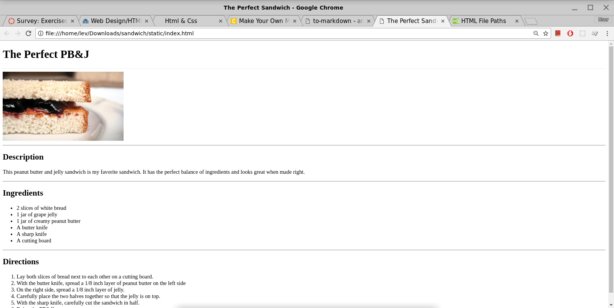

# Project - Lists - Recipe

[Source: Coder](https://googlecreativelab.github.io/coder-projects/projects/perfect_recipe/)

## Instructions

Make a page about a favorite recipe. It should looke similar to this:

Include the following:

1. A main heading.
2. A description.
3. An unordered list of ingerdients.
4. An ordered list of directions.

### Bonus

* Add an image below the main heading