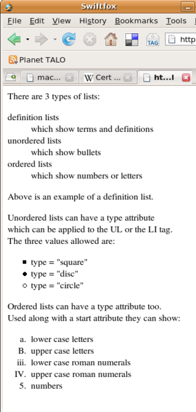
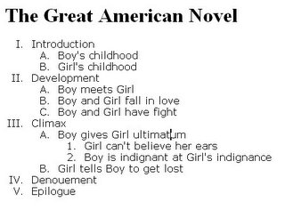

# Project - Lists

[Source: Wikiversity](https://en.wikiversity.org/wiki/Web_Design/HTML_Challenges)

## Links

* [W3Schools - HTML Lists](https://www.w3schools.com/html/html_lists.asp)

## Instructions

### Numbers, Bullets and Definitions

Re-create the html page shown below:

There are 3 lists on the page: a definition list, an unordered list, and an odd looking ordered list. To re-create the ordered list you'll need to add a `type` attribute to each LI tag.

### Nested Lists

A `nested` list is a list that contains another list. On the web, they're commonly used for indexes or tables of contents or menus that show all the pages inside of a section of a website.

Try recreating the nested list shown below. 
Hint: To recreate the nested list from the image, you'll need to use the 'type' attribute on the UL or OL tags. Like the previous list, adding this attribute will make your code invalid, but we can correct it later by using CSS instead.

