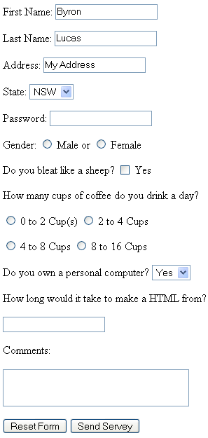

# Project - Simple Form

[Source: Wikiversity](https://en.wikiversity.org/wiki/Web_Design/HTML_Challenges)

## Instructions

Create a small online survey with four questions of your own. Your survey should first collect the participant's details, followed by four questions to answer.

Ensure that your survey includes:

* Simple text inputs
* A password input.
* Select drop-down boxes (for State, or within your questions).
* Radio buttons and checkboxes (as part of your form design).
* A large text area for comments at the end.
* A submit button with your own text (such as "Send Survey")
* A reset button.

Here is an example for reference:

