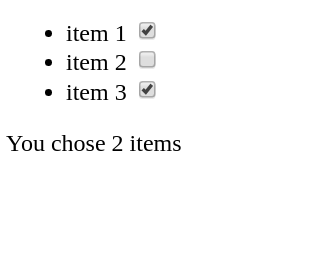
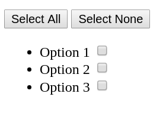

# React `checkbox`es - Exercises

## Not (Not A Robot)

Create a react component that will render the text `I am not a robot` followed by a single checkbox. When the checkbox is checked, display the text `"Robots Only"`. When the checkbox is uncheked, display a button labeled `"proceed"`. Make the checkbox checked on the first render.

## You Chose _ Items

Create a component that will render a list with three items and three corresponding checkboxes. Below the list, display the text `"You Chose _ Items"` where `_` is replaced by the number of checkboxes that the user checked.

**hint**: You may store the number of chosen items in a separate property in the component's `state`. Then you can update that property in the `handleCheckBoxChange` function.

### Select All

Create a react component that will three options and three corresponding checkboxes. Above these, add two buttons:

* `select all`: will check all checkboxes.
* `select none`: will uncheck all checkboxes.

### Cats, Dogs, or Neither

Create a react component that will three items and three corresponding checkboxes:

 If the user checks `neither`, both `cats` and `dogs` checkboxes will be automatically unchecked. If the user checks `cats` or `dogs`, the `neither` checkbox will be automatically unchekced.

 **bonus** use the `disabled` attribute to disable the `cats` and `dogs` checkboxes when `neither` is checked.

### Select All v2

Modify `select all` above. Instead of two buttons, display a checkbox that, when checked, will check all other items, and when unchecked, will uncheck all other items.

**bonus** if `select all` is checked, and one of the options gets unchecked, `select all` should be unchecked as well.

