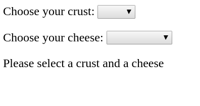
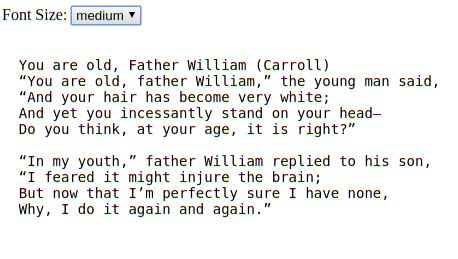

# React `select`s Exericses

## Ordering Pizza

Create a react `PizzaOrder` component with two select elements - one for crust (thick or thin) and one for cheese (mozzarella, chedar, colby, provolone). If the user has selected both a crust and a cheese (i.e. the selected values are not empty strings), display an order summary:


If the user did not select a crust and a cheese, display the message: 'please select a crust and a cheese'.



## Reader v2

Create a react component called `Reader` that will display the first two verses of the following poem:

```text
You are old, Father William (Carroll)
“You are old, father William,” the young man said,
“And your hair has become very white;
And yet you incessantly stand on your head–
Do you think, at your age, it is right?”

“In my youth,” father William replied to his son,
“I feared it might injure the brain;
But now that I’m perfectly sure I have none,
Why, I do it again and again.”
```

Define the poem outside the class, and pass it the text as a prop.

Use a `<pre>` tag to display the poem in your `render` function. In your html file, define three css classes under a `<style>` tag:

```css
  .small {
    font-size: 12px;
  }
  .medium {
    font-size: 14px;
  }
  .large {
    font-size: 16px;
  }
```

Define your `state` with `fontClass` property initially set to `small`. Also define an array in your class with the string values `small`, `medium` and `large`.
In your `render` function,  include a `select` element above the poem with the possible values `small`, `medium` and `large`. Assign the `fontClass` as the `className` for `pre` element that contains the poem. When the user change the choice in the `select`, the class assigned to the `pre` element should change as well.


