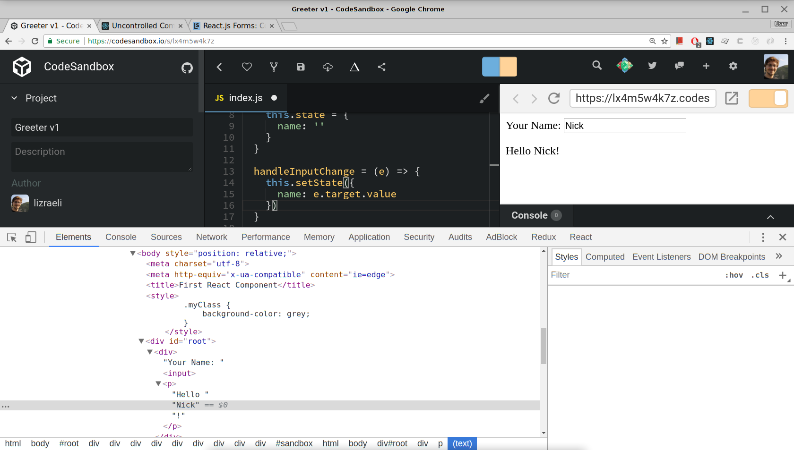

# React - User Input 1

## Sources

* [Forms - React Docs](https://reactjs.org/docs/forms.html)

## Lesson

One of react's strengths is in handling dynamic ui. One such case is when the html changes based on user input.

### [Greeter v1](https://codesandbox.io/s/lx4m5w4k7z)

Let's consider an example of an input field for a user's name, where a greeting is rendered in real-time with that name. We begin by setting the state with a `name` property:

```jsx
class Greeter extends React.Component {
  constructor() {
    super();
    this.state = {
      name: ''
    }
  }
  ...
```

Next, we define a render function that returns a name input field and a greeting.

```jsx
  ...
  render() {
    return (
      <div>
        <p>
          Your Name: <input onInput={this.handleInputChange}/>
        </p>
        <p>
          Hello {this.state.name}!
        </p>
      </div>
    )
  }
  ...
```

Note the `/>` closing tag for `input` - in JSX, elements that do not have a separate closing tag _must_ end with `/>`.

When the component is initially rendered, the greeting will be `Hello !` - as the default value of `state.name` is an empty string.

Note that we have defined an `onInput` function for the input field. When implementing it, remember to use the automatically-bound function syntax we used in the last lesson.

```jsx
  ...
  handleInputChange = (e) => {
    this.setState ({
      name: e.target.value
    })
  }
  ...
```

The `handleInputChange` function is passed the input event as an argument. It then sets the `state.name` property to the value of the input field (which is the target of the event). When the  `setState` method is called, the corresponding property in the `state` object will change, and the render function will be called, and the name will be displayed in the paragraph below.

#### Activity: Inspecting the DOM

Inspect the generated html and find the rendered DOM elements. You should be able to see the following:



Note which DOM elements get re-rendered when you insert an input.

### (Un)Controlled Input

In the example above, we allowed the HTML input field to behave in its default way. Every html input field is interactive, as it keeps track of its own "state", where the state consists of the user's input to that field. We can, instead, give our react component control over the input field.

### [Greeter v2](https://codesandbox.io/s/xp15yr6x2z)

All we need to do is assign a `value` attribute to the JSX input element, setting it to be equal to `state.name`:

```jsx
 render() {
    return (
      <div>
        <p>
          Your Name: {" "}
          <input
            value={this.state.name}
            onInput={this.handleInputChange}
          />
        </p>
        ....
    )
  }
  ...
```

Note the following:

* The space inside the curly braces `{" "}` above ensures that there will be a space between `Your Name:` and the input field.
* The input element is split across four lines. This is done in order to make the attributes easier to read.

#### Activity: No change for input

Try to comment the following in the `render` function.

```jsx
  handleInputChange = e => {
    this.setState({
     // name: e.target.value
    })
  };
```

Now you try to insert your name, you will notice that the input field doesn't change. Compare the html DOM when the line above is commented and uncommented, and try to answer why the input value is not changing.

### [Clearing the Input](https://codesandbox.io/s/9y3qx7k5jo)

Controlled input allows us to manipulate the input value by other means. For exmaple, we may add a `clear` button that will erase our current input. 

We will first add a `clearInput` method to the component:

```jsx
  ...
  clearInput = () => {
    this.setState({
      name: ''
    })
  }
  ...
```

And then add a JSX `button` element with an `onClick` attribute to call the `clearInput` function.

```jsx
render() {
    return (
      <div>
        <p>
          Your Name: {" "}
          <input
            value={this.state.name}
            onInput={this.handleInputChange}
          />
          <button onClick={this.clearInput}>
           Clear
          </button>
        </p>
      ...
```

Now, whenver we click on the `clear` button, both the input field and the greeting will be cleared.

### [Validating Input](https://codesandbox.io/s/p5rrx26ln0)

We can also validate the user input using controlled input fields. LEt's say we would like to get a username that is between `3` and `8` characters long. We will define the `state` with two variables:

```jsx
  ...
  this.state = {
    username: '',
    validInput: false
  };
  ...
```

The `validInput` property is initially set to false because the username is `0` characters long.

We will then set the `handleInputChange` function to check if the input for the username is between 3-8 characters:

```jsx
  ...
  handleInputChange = e => {
    const username = e.target.value;
    const validInput = username.length >= 3 && username.length <= 8;

    this.setState({
      username,
      validInput
    })
  };
  ...
```

Finally, we will define a `render` function with a username input and a message. The input will look identical to the previous ones. To keep our code clean, we will generate the message before the `return` statement:

```jsx
  render() {
    const message = this.state.validInput ?
      <span className='valid'> OK </span>
      : <span className='invalid'> Username must be between 3 - 8 characters </span>
  ...
```

The code above assigns one of two JSX elements to the `message` variable:

* If the `state.validInput` variable has the value `true`, we assign to `message` a span element with the `valid` class and the text `OK`.
* Otherwise, we assign to `message` a span element with the `invalid` class and the text `Username must be between 3 - 8 characters`.

(The styling for the classes is defined in the HTML page)

Finally, we `return` the input and the message:

```jsx
  ...
   return (
      <div>
        <p>
          username: {" "}
          <input
            value={this.state.name}
            onInput={this.handleInputChange}
          />
        </p>
        <p>
          {message}
        </p>
      </div>
    );
  }
  ...
```
