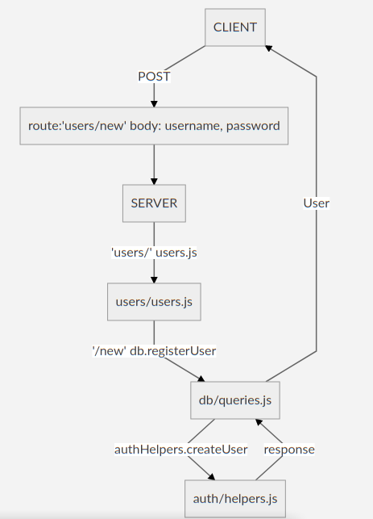
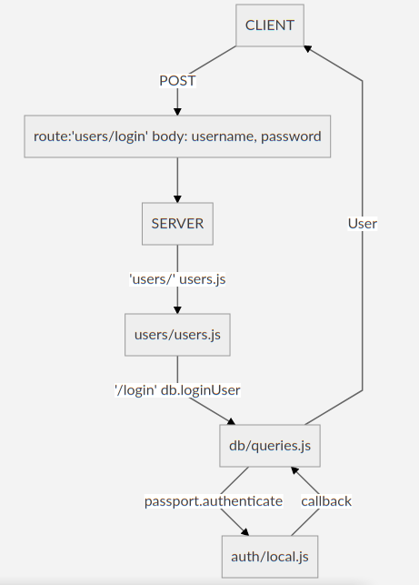

# Registering Users - Lesson 2

## Resources

* [Express React Auth 2 Repo](https://github.com/lizraeli/express_fullstack_auth_2)
* [Michael Herman's Tutorial](http://mherman.org/blog/2016/09/25/node-passport-and-postgres/)
* [Example using pg-promise](https://github.com/crymall/express_fullstack_example)
* [Registering Users - Lesson 1](../user_registration/user_registration.md)

Today, we will continue building up a fullstack app with express, postgres and react.

## Backend: Folder Structure

The following are some of the important folders and files of the backend express server:

```text
+ auth/
  - helpers.js
  - local.js
  - passport.js
+ db/
  - index.js
  - queries.js
  - users.sql
+ routes/
  - users.js
- app.js
```

## Event Flows

There are several flows of events that can happen, starting from the client, going to the server, and back to the client.

### Register User



### Login User



The above flows are for when the request is successful. The flow would be different for things that fail at any point.

## Exercises

Draw similar diagrams for the events flows for the following requests:

```text
GET "/HOBBIES"
PATCH "/HOBBIES
```

Note that the event flow may go in different "directions": the user may or may not be authenticated, etc.
